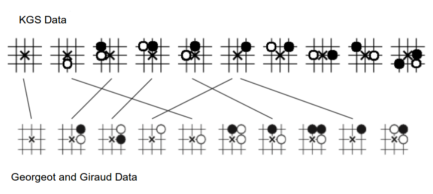

Go-AI
=====

Constructs a pagerank vector of the most popular moves in the game of Go for a given data set of games recorded in sgf format — based on Georgeot and Giraud's paper _[The Game of Go as a Complex Network](http://arxiv.org/abs/1105.2470)_.

This should be a good starting point if you're looking to construct a network of moves in Go, although there are some differences in my implementation and the one used by Georgeot and Giraud – for example, I do not take into account all the symmetries of plaquettes that they do.

Here is a comparison of the top ten moves for λ1, using sample data from the [K Go Server](http://www.u-go.net/gamerecords/).

